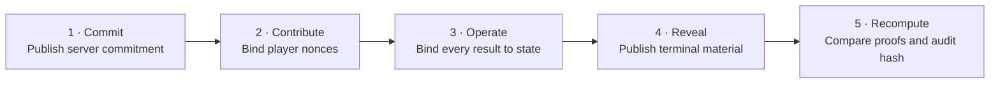

<p align="center">
  
</p>

# OpenSlay-VF

<p align="center">
  <strong>Independent verification for OpenSlay randomness transcripts.</strong>
</p>

<p align="center">
  <a href="https://github.com/CA7AX/OpenSlay-VF/actions/workflows/ci.yml"></a>
  
  <a href="LICENSE"></a>
  <a href="SPEC.md"></a>
</p>

<p align="center">
  <a href="#quick-start">Quick start</a> ·
  <a href="#what-it-verifies">Scope</a> ·
  <a href="#how-verification-works">Protocol flow</a> ·
  <a href="SPEC.md">Specification</a> ·
  <a href="SECURITY.md">Security</a> ·
  <a href="README.zh-CN.md">简体中文</a>
</p>

> **Without verification comes no fairness.**
>
> OpenSlay-VF independently recomputes OpenSlay randomness transcripts—from
> the pre-game commitment to the terminal audit hash—without importing the
> private game engine and without runtime dependencies.

> [!IMPORTANT]
> Verification establishes transcript consistency under the assumptions in
> [the protocol specification](SPEC.md). It does **not** certify entropy,
> server honesty, legal game-state transitions, match completion, or overall
> game fairness.

## What it verifies

| The public evidence it recomputes | What it deliberately does not prove |
| --- | --- |
| Server commitment and player contributions | The quality of the original entropy or the server's honesty |
| Online and deterministic-training seed derivation | The legality of transitions between recorded game states |
| State-bound HMAC-SHA256 results and proofs | That every client received the same live history |
| `probability`, `choice`, `sample`, and `shuffle` operations | The correctness or completeness of every game rule |
| State/context digests, purpose counters, global order, hash chain, reveal, and final audit hash | Match completion or fairness outside the published randomness protocol |
| Optional local-witness consistency and public rule-input constraints | Private engine, character, server, matchmaking, or UI behavior |

The package owns the public encodings, bounded HMAC stream, semantic random
operations, generic oracle, transcript verifier, witness checks, bilingual
reporting, CLI, and public data. It never imports the OpenSlay engine. An
application constructing the generic oracle must supply an explicit ruleset
hash.

## Quick start

OpenSlay-VF requires Python 3.10 or newer and has no runtime dependencies.

```bash
git clone https://github.com/CA7AX/OpenSlay-VF.git
cd OpenSlay-VF
python -m pip install -e .
openslay-rng-verify /path/to/match.jsonl --rules bundled
```

Add a local witness, request stable JSON, or select a report language:

```bash
openslay-rng-verify /path/to/match.jsonl \
  --witness /path/to/randomness_witness/<match-hash>.jsonl
openslay-rng-verify /path/to/transcript.json --json
python -m openslay_rng_verifier /path/to/match.jsonl --language zh
```

The transcript argument may be a full game JSONL replay, a compact JSON object
containing `records`, a JSON list of records, or a directory whose newest
recognizable transcript should be selected. Human-readable output defaults to
Chinese and English; `--json` keeps stable, language-neutral field names and
status values.

| Exit code | Meaning |
| ---: | --- |
| `0` | Every requested verification completed |
| `1` | Data is invalid or internally conflicting |
| `2` | Evidence is incomplete, unverified, partial, or missing |

## How verification works



Each random operation is bound to its canonical pre-operation state and
context digest, purpose-specific counter, and global sequence number. The
verifier rebuilds the HMAC stream and transcript hash chain, validates the
terminal reveal, and derives the final audit hash. The exact byte encodings and
formulas are normative in [SPEC.md](SPEC.md).

### Rules without engine disclosure

Public data-only descriptors can constrain an operation's `purpose`, type, and
inputs without publishing the event engine that implements the rule. The
[bundled prototype descriptor](data/openslay-prototype-v1.partial.json) is
explicitly **partial**: described operations are checked, while unlisted
purposes remain outside that result.

### Local witness

A `randomness_witness` sidecar cross-checks the terminal transcript against the
checkpoints one client persisted during play. A complete witness proves
consistency with that client's observed history; it cannot prove that every
client saw the same history. Players can compare the full final audit hash—or
the five-group short seal—to detect divergent terminal histories.

## Reading the result

| Transcript status | Meaning |
| --- | --- |
| `Verified fair` | Online commitment, contributions, reveal, and random operations all verify |
| `Verified deterministic` | A training transcript reproduces from its declared seed and public input |
| `Incomplete` | Required evidence is absent or ends before verification can finish |
| `Unverified` | The available evidence cannot establish the requested claim |
| `Invalid` | Evidence is malformed, contradictory, or fails recomputation |

Witness results are reported separately (`Complete`, `Missing`, `Incomplete`,
or `Invalid`). Public rule checks are also separate (`Verified`, `Partial`,
`Invalid`, or `Not checked`), so a successful cryptographic transcript check
is never silently expanded into a broader rules claim.

## Python API

```python
from openslay_rng_verifier import load_transcript, verify_records

records, resolved_path = load_transcript("match.jsonl")
report = verify_records(records)
print(report.status, report.final_audit_hash)
```

Optional witness and rule checks compose with the same report:

```python
from openslay_rng_verifier import (
    load_ruleset,
    load_witness,
    verify_declared_rules,
    verify_witness,
)

header, checkpoints = load_witness("witness.jsonl")
witness = verify_witness(header, checkpoints, records)
rules = verify_declared_rules(report, load_ruleset("bundled"))
```

Use `format_human_report(..., language="bilingual")` for the same bilingual
presentation as the CLI without changing the underlying report objects.

## Codebase map

| Path | Responsibility |
| --- | --- |
| [`oracle.py`](oracle.py) | Canonicalization, derivation, bounded HMAC streams, and generation |
| [`operations.py`](operations.py) | Semantic `probability`, `choice`, `sample`, and `shuffle` operations |
| [`verifier.py`](verifier.py) | Transcript loading, validation, and independent recomputation |
| [`witness.py`](witness.py) | Local checkpoint and short-seal cross-checking |
| [`rules.py`](rules.py) | Data-only public rules descriptors and input constraints |
| [`localization.py`](localization.py) | Chinese, English, bilingual, and machine-readable reporting |
| [`SPEC.md`](SPEC.md) / [`SPEC.zh-CN.md`](SPEC.zh-CN.md) | Normative public protocol |
| [`test-vectors/`](test-vectors) | Synthetic, public protocol fixtures—not deployed credentials |

The repository root is also the `openslay_rng_verifier` package directory. It
is a complete standalone Python project: no game engine, character
implementation, server, matchmaking system, UI, or private build source is
included.

## Development and release gates

```bash
python -m pip install -e ".[test,release]"
python -m pytest -q
python tools/release_gate.py --mode ci
python tools/build_release.py dist
python tools/verify_artifacts.py dist
```

CI runs the standalone suite on Linux, Windows, and macOS across Python
3.10–3.14, audits the public-source boundary, builds twice from clean Git
archives, and verifies the resulting distributions before upload.

Please follow [CONTRIBUTING.md](CONTRIBUTING.md) for patches and report
suspected vulnerabilities through the private process in
[SECURITY.md](SECURITY.md).

## Release maturity and license

All `0.x` versions are development prereleases. A stable `1.0` requires a
complete public rules descriptor whose hash is bound into the game transcript.

OpenSlay-VF is distributed under the [BSD 3-Clause License](LICENSE).
