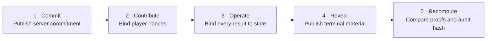

<p align="center">
  
</p>

<h1 align="center">⚔️ OpenSlay-VF ⚔️</h1>

<p align="center">
  <strong>Don't trust. Recompute.</strong><br/>
  <sub>Independent, zero-dependency verification for OpenSlay randomness transcripts —<br/>
  from the pre-game commitment to the terminal audit hash.</sub>
</p>

<p align="center">
  <a href="https://github.com/CA7AX/OpenSlay-VF/actions/workflows/ci.yml"></a>
  
  
  <a href="LICENSE"></a>
  <a href="SPEC.md"></a>
</p>

<p align="center">
  
  
  
  
  
</p>

<p align="center">
  <a href="#-quick-start">Quick start</a> ·
  <a href="#-what-it-verifies">Scope</a> ·
  <a href="#-how-verification-works">Protocol flow</a> ·
  <a href="#-python-api">Python API</a> ·
  <a href="SPEC.md">Specification</a> ·
  <a href="SECURITY.md">Security</a> ·
  <a href="README.zh-CN.md">简体中文</a>
</p>

---

<p align="center">
  <strong>「 Without verification comes no fairness. 」</strong><br/>
  <sub>不经验证，无以言公。</sub>
</p>

OpenSlay-VF takes the randomness transcript a match leaves behind and
**replays every single random operation from scratch** — commitments, seed
derivation, HMAC stream, hash chain, terminal reveal — without importing the
private game engine or adding runtime dependencies. For an online match, the
terminal transcript discloses the human client nonces and per-match server
secret needed for recomputation; the verifier needs no separate nonce input or
access to still-secret deployment credentials. If the published evidence
doesn't recompute, the transcript doesn't pass. It's that simple.

An abridged example follows; summary and detail lines are omitted, and hashes
are shortened for display:

```console
$ openslay-rng-verify /path/to/match.jsonl --rules bundled

OpenSlay 随机性验证报告 / OpenSlay Randomness Verification Report
[… transcript path omitted …]
验证状态 / Verification status: 验策相合 / Verified fair
[… verification summary omitted …]
随机操作数 / Random operations: 312
已验证牌堆纪元 / Deck epochs verified: 2
终局审计哈希 / Final audit hash: 9f2c…e41a

公开规则 / Public rules: 已验证 / Verified
[… rule summary, count, and descriptor hash omitted …]

$ echo $?
0
```

> [!IMPORTANT]
> Verification establishes **transcript consistency** under the assumptions in
> [the protocol specification](SPEC.md). It does **not** certify entropy,
> server honesty, legal game-state transitions, match completion, or overall
> game fairness. Precision about limits is a feature, not a disclaimer.

## 🧭 What it verifies

<table>
<tr>
<th>✅ The public evidence it recomputes</th>
<th>🚫 What it deliberately does not prove</th>
</tr>
<tr>
<td>

- Server commitment and player contributions
- Online and deterministic-training seed derivation
- State-bound HMAC-SHA256 results and proofs
- `probability`, `choice`, `sample`, and `shuffle` operations
- State/context digests, purpose counters, global order, hash chain, reveal, and final audit hash
- Optional local-witness consistency and public rule-input constraints

</td>
<td>

- The quality of the original entropy or the server's honesty
- The legality of transitions between recorded game states
- That every client received the same live history
- The correctness or completeness of every game rule
- Match completion or fairness outside the published randomness protocol
- Private engine, character, server, matchmaking, or UI behavior

</td>
</tr>
</table>

The package owns the public encodings, bounded HMAC stream, semantic random
operations, generic oracle, transcript verifier, witness checks, bilingual
reporting, CLI, and public data. It never imports the OpenSlay engine. An
application constructing the generic oracle must supply an explicit ruleset
hash.

<table align="center">
<tr>
<th>🔁 Reproducible</th>
<th>🔗 Traceable</th>
<th>🧱 Independent</th>
<th>🪶 Lightweight</th>
</tr>
<tr>
<td>Replays random operations from public terminal material</td>
<td>Every step bound to state, context, and sequence</td>
<td>Never imports the private game engine at runtime</td>
<td>Python 3.10+, zero third-party runtime dependencies</td>
</tr>
</table>

## 🚀 Quick start

OpenSlay-VF requires Python 3.10 or newer and has **no runtime dependencies**.

```bash
git clone https://github.com/CA7AX/OpenSlay-VF.git
cd OpenSlay-VF
python -m pip install -e .
openslay-rng-verify /path/to/match.jsonl --rules bundled
```

Add a local witness, request stable JSON, or select a report language:

```bash
openslay-rng-verify /path/to/match.jsonl \
  --witness /path/to/randomness_witness/<match-hash>.jsonl
openslay-rng-verify /path/to/transcript.json --json
python -m openslay_rng_verifier /path/to/match.jsonl --language zh
```

The transcript argument may be a full game JSONL replay, a compact JSON object
containing `records`, or a JSON list of records. A directory input is narrower:
it searches recursively for game `*.jsonl` logs and selects the newest
recognizable one; it does not discover compact `.json` transcripts. Only an
unterminated final JSONL record can be classified as a truncated, incomplete
write. Malformed or truncated compact JSON is invalid input. Human-readable
output defaults to Chinese and English; `--json` keeps stable, language-neutral
field names and status values.

| Exit code | Meaning |
| ---: | --- |
| `0` | Every requested verification completed |
| `1` | Data is invalid or internally conflicting |
| `2` | Evidence is incomplete, unverified, partial, or missing |

Before verification begins, `argparse` also returns exit code `2` for
command-line usage errors such as a missing transcript argument, an unknown
option, or an invalid option value. Those errors are written to standard error
and do not represent an `Incomplete` or `Unverified` verification result.

## 🔬 How verification works



Each random operation is bound to its canonical pre-operation state and
context digest, purpose-specific counter, and global sequence number. The
verifier rebuilds the HMAC stream and transcript hash chain, validates the
terminal reveal, and derives the final audit hash. The exact byte encodings and
formulas are normative in [SPEC.md](SPEC.md).

### Rules without engine disclosure

Public data-only descriptors can constrain an operation's `purpose`, type, and
inputs without publishing the event engine that implements the rule. The
[bundled prototype descriptor](data/openslay-prototype-v1.partial.json) is
explicitly **partial**: described operations are checked, while unlisted
purposes remain outside that result.

### Local witness

A `randomness_witness` sidecar cross-checks the terminal transcript against the
supplied checkpoints. A `Complete` result proves equality with those supplied
checkpoints only. Treating them as records persisted during play requires
trusted, non-rewritable local provenance, and even then says nothing about what
other clients saw. Players can compare the full 256-bit final audit hash for a
hash-level comparison of the hash-bound randomness record contexts; it does not
cover outer envelope metadata or arbitrary non-random game or UI history. The
five-group short seal is only an
80-bit prefix for convenient manual comparison: it can quickly expose many
mismatches, but matching short seals do not establish equality of the full
hashes.

## 📜 Reading the result

| Transcript status | Meaning |
| --- | --- |
| `Verified fair` | Online commitment, contributions, reveal, and random operations all verify |
| `Verified deterministic` | A training transcript reproduces from its declared seed and public input |
| `Incomplete` | Required evidence is absent or ends before verification can finish |
| `Unverified` | The available evidence cannot establish the requested claim |
| `Invalid` | Evidence is malformed, contradictory, or fails recomputation |

Witness results are reported separately (`Complete`, `Missing`, `Incomplete`,
or `Invalid`). Public rule checks are also separate (`Verified`, `Partial`,
`Invalid`, or `Not checked`), so a successful cryptographic transcript check
is never silently expanded into a broader rules claim.

## 🐍 Python API

```python
from openslay_rng_verifier import load_transcript, verify_records

records, resolved_path = load_transcript("match.jsonl")
report = verify_records(records)
print(report.status, report.final_audit_hash)
```

Optional witness and rule checks compose with the same report:

```python
from openslay_rng_verifier import (
    load_ruleset,
    load_witness,
    verify_declared_rules,
    verify_witness,
)

header, checkpoints = load_witness("witness.jsonl")
witness = verify_witness(header, checkpoints, records)
rules = verify_declared_rules(report, load_ruleset("bundled"))
```

Use `format_human_report(..., language="bilingual")` for the same bilingual
presentation as the CLI without changing the underlying report objects.

## 🗺️ Codebase map

| Path | Responsibility |
| --- | --- |
| [`oracle.py`](oracle.py) | Canonicalization, derivation, bounded HMAC streams, and generation |
| [`operations.py`](operations.py) | Semantic `probability`, `choice`, `sample`, and `shuffle` operations |
| [`verifier.py`](verifier.py) | Transcript loading, validation, and independent recomputation |
| [`witness.py`](witness.py) | Local checkpoint and short-seal cross-checking |
| [`rules.py`](rules.py) | Data-only public rules descriptors and input constraints |
| [`cli.py`](cli.py) / [`localization.py`](localization.py) | CLI entry point, stable JSON, and Chinese, English, or bilingual human-readable reporting |
| [`SPEC.md`](SPEC.md) / [`SPEC.zh-CN.md`](SPEC.zh-CN.md) | Normative public protocol |
| [`test-vectors/`](test-vectors) | Synthetic, public protocol fixtures—not deployed credentials |

The repository root is also the `openslay_rng_verifier` package directory. It
is a complete standalone Python project: no game engine, character
implementation, server, matchmaking system, UI, or private build source is
included.

## 🛡️ Development and release gates

```bash
python -m pip install -e ".[test,release]"
python -m pytest -q
python tools/release_gate.py --mode ci
python tools/build_release.py dist
python tools/verify_artifacts.py dist
```

CI runs the standalone suite on Linux, Windows, and macOS across Python
3.10–3.14, audits the public-source boundary, builds twice from clean Git
archives, and verifies the resulting distributions before upload.

Please follow [CONTRIBUTING.md](CONTRIBUTING.md) for patches and report
suspected vulnerabilities through the private process in
[SECURITY.md](SECURITY.md).

## 📦 Release maturity and license

All `0.x` versions are development prereleases. A stable `1.0` requires a
complete public rules descriptor whose hash is bound into the game transcript.

OpenSlay-VF is distributed under the [BSD 3-Clause License](LICENSE).

---

<p align="center">
  <sub>⚔️ <strong>Without verification comes no fairness.</strong> 不经验证，无以言公。 ⚔️</sub>
</p>
